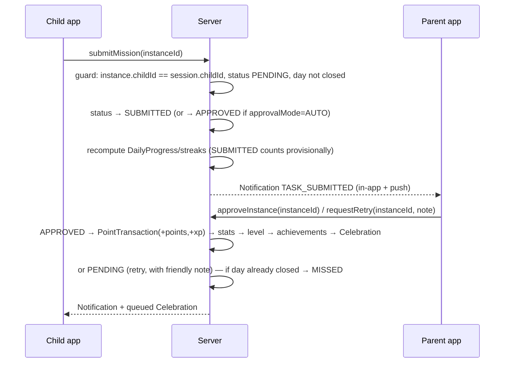
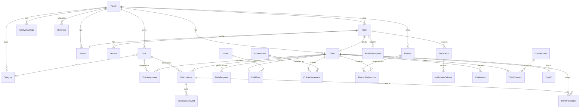

# Mission Quest — Phase 1: Product & Technical Architecture

> Working name: **Mission Quest** (rename anytime — it only appears in copy and the PWA manifest).
> This document is the source of truth for Phases 2–8. When a later phase deviates from it, update this file.

---

## 0. Decisions at a glance

| Area | Decision | Why (short) |
|---|---|---|
| Framework | Next.js (App Router, React Server Components, Server Actions) + TypeScript | Vercel-native, server-side auth by default, one codebase for both experiences |
| Styling | Tailwind CSS v4 + shadcn/ui (parent) + bespoke game components (child) | Parent UI needs dense, accessible primitives; child UI must not look like an admin panel |
| Animation | Motion (Framer Motion), `canvas-confetti`, CSS keyframes, `prefers-reduced-motion` respected everywhere | Performant, declarative, easy to gate |
| Database | PostgreSQL on Neon (Vercel Marketplace) via Prisma | Serverless-friendly, branch-per-preview, relational integrity |
| Auth | Own minimal session auth (DB-backed sessions, Argon2id hashes, HttpOnly cookies) — **not** Auth.js | Credentials-only product (children have no email/OAuth); Auth.js's Credentials provider forbids DB sessions and is discouraged by its own docs. See §5 |
| Validation | Zod on every server boundary; `react-hook-form` for parent forms | Server is the only authority |
| Notifications | Provider-agnostic `NotificationService` → in-app (always) + Web Push (VAPID) + Email (Resend), DB outbox with dedupe keys | Extensible, idempotent, works with Vercel Cron |
| Scheduling | Vercel Cron → `/api/cron/tick` (hourly) + **lazy self-healing on read** | Correctness never depends on cron; cron only makes reminders timely |
| Day boundaries | One IANA timezone per **family**; every daily fact is keyed by a `localDate` string (`YYYY-MM-DD`) | Kids' devices lie about time; families share one "today" |
| Points vs XP | **Two counters from one ledger**: Points (spendable on rewards) and XP (lifetime, drives level). Every earning credits both; redemptions only debit Points | Otherwise redeeming a reward de-levels the child |
| Approval | Per-task `approvalMode`: `PARENT` (default for chores) or `AUTO` (for hygiene/routine) | Removes the parent bottleneck without removing parent control |
| Streak days | Only days with ≥1 assigned task count; rest days are transparent; parent can grant "day off" (streak freeze) | A Sunday with no missions must not break a streak |

---

## 1. Product architecture

### 1.1 The two experiences

```
                         ┌──────────────────────────────┐
                         │        Family (tenant)        │
                         │  timezone · mode · settings   │
                         └──────────────┬───────────────┘
              ┌───────────────────────┬─┴──────────────────────┐
              ▼                       ▼                        ▼
   ┌────────────────────┐   ┌────────────────────┐   ┌────────────────────┐
   │  Parent account(s) │   │   Child: Alex      │   │   Child: Maya      │
   │  /parent/*         │   │   /kid/*           │   │   /kid/*           │
   │  clean, analytical │   │   game-like        │   │   game-like        │
   └────────────────────┘   └────────────────────┘   └────────────────────┘
```

- A **Family** is the tenant boundary. Everything (tasks, categories, rewards, notifications, ledger) hangs off a family.
- **Parent** users manage. A family can have more than one parent (co-parents) from day one in the schema; inviting the second parent is a V1.1 UI item.
- **Child** users play. A child sees only their own data. Sibling data is only visible through explicitly-designed, parent-enabled family features (cooperative goal / optional leaderboard).

### 1.2 The core loop

```
 Parent creates Task ──► Scheduler materializes TaskInstances per child per localDate
                                              │
                    Child sees "Today's Missions" ◄────────────┘
                                              │
                        Child taps "Done!" ──► SUBMITTED  (AUTO tasks: → APPROVED instantly)
                                              │
                   Parent approves / asks to retry ──► APPROVED → PointTransaction (+points, +XP)
                                              │
     DailyProgress recomputed ──► Streaks recomputed ──► Level check ──► Achievements check
                                              │
                       Celebration queued for child ──► played next time the child looks
                                              │
                           Child spends Points on parent-defined Rewards
```

Two design principles fall out of this:

1. **Everything numeric is derived from history.** Points, XP, level, streaks, golden streaks, completion % are all computed from `PointTransaction`, `TaskInstance` and `DailyProgress` rows. The `ChildStats` row is a cache that can be rebuilt at any time.
2. **Celebrations are queued, not fired.** The parent approving at 9pm must not require the child to be watching. A `Celebration` row is created and played (batched) the next time the child opens the app. Auto-approved tasks celebrate instantly.

### 1.3 Domain vocabulary (used consistently in code and copy)

| Term | Meaning |
|---|---|
| Task | A parent-defined template: title, icon, points, schedule, rollover policy, approval mode |
| TaskInstance | "This task, for this child, on this local date" — the thing a child actually completes. Snapshots title/points at creation so history survives edits |
| Mission | Child-facing word for a TaskInstance |
| Local date | `YYYY-MM-DD` in the family's timezone. All daily math uses this, never UTC dates |
| Day close | The moment (family midnight) a local date is finalized: pending instances become MISSED / roll over, bonuses are awarded, streaks recomputed |
| Streak | Consecutive counted days with ≥1 completed mission |
| Golden streak | Consecutive counted days with 100% of assigned missions completed |
| Counted day | A local date on which the child had ≥1 assigned, non-cancelled mission and no day-off |
| Points | Spendable currency (rewards) |
| XP | Lifetime progression score (levels, world map). Never decreases from spending |
| Celebration | A queued visual event (mission approved, level up, achievement, golden day) |

---

## 2. User flows

### 2.1 Parent onboarding (first run)

1. `/signup` — email, password, display name → creates User(PARENT) + Family (timezone auto-detected from browser, confirmable).
2. `/parent/onboarding` wizard (state persisted per step so refresh doesn't lose progress):
   1. **Family** — family name, timezone, family mode (Individual / Cooperative / Leaderboard; default Cooperative).
   2. **First child** — name, username (family-unique), password or 4-digit PIN, avatar base + colour.
   3. **Starter missions** — pick from age-grouped starter packs (e.g. "Morning routine", "School days", "Bedroom") or write your own. Each shows icon, points, schedule; 3–5 preselected.
   4. **Approval & rollover defaults** — one screen explaining `AUTO` vs `PARENT` approval and the three rollover policies, with sensible defaults applied to the picked missions.
   5. **Reminders** — enable push (browser prompt), evening "streak at risk" reminder time, quiet hours.
   6. **Done** — shows the child's login card (family code + username) with a "Print / share login card" action, and a link to add more children (up to 3 in V1; limit is a config value).
3. Lands on `/parent` dashboard.

### 2.2 Child first session

1. `/kid/login` — enter family code (remembered on device) → tap your avatar → password/PIN. (Fallback: username + password form.)
2. `/kid/welcome` — 3-step animated intro: "Meet your character" (customize base/colour), "This is your streak", "Your first missions are waiting".
3. `/kid` home — first mission card pulses gently ("Tap when you're done!").
4. Tap **Done!** → immediate mini-celebration ("Sent to Mom/Dad ✨" or, for AUTO tasks, the full "MISSION COMPLETE! +10" celebration).
5. On approval, the queued celebration plays on next open: confetti, points fly to the counter, streak flame ignites ("Day 1! 🔥 Come back tomorrow to make it 2").

### 2.3 Child daily loop

Open app → **3-second rule** hero: today's ring (4/5), points today, streak flame, golden status → mission list grouped by time of day (Morning / Afternoon / Evening / Anytime), pending ones first → tap Done → see "Waiting for approval" state → later: celebration playback → check map/achievements → maybe redeem reward.

### 2.4 Parent daily loop

Open app → dashboard cards per child (streak, golden, points this week, completion %) → **Needs approval** badge → approve individually or "Approve all" → optionally send a reminder → evening summary notification ("Alex has 1 mission left — golden streak at risk").

### 2.5 Approval / retry



### 2.6 Reward redemption

Child opens Rewards → sees affordable rewards highlighted → "Ask for this" → points are **reserved** (negative ledger entry, status REQUESTED) → parent approves (FULFILLED) or declines (REFUND entry, encouraging copy) → child sees history.

### 2.7 Day close (automated)

Runs per family when local time passes midnight (cron) **or** lazily on the first read after midnight:

1. For each child, for each unclosed local date < today:
   - PENDING instances: `EXPIRE` → MISSED; `ROLLOVER` → MISSED + new instance for the next day (max one hop); `PERSIST` → stays PENDING (shows as overdue).
   - SUBMITTED instances stay SUBMITTED (parent may still approve; counts provisionally).
   - Recompute `DailyProgress`; award perfect-day / streak bonuses (idempotent via unique constraints); recompute streaks; evaluate achievements; queue celebrations; mark `lastClosedDate`.
2. Ensure today's instances exist for every active assignment (idempotent).

### 2.8 Reminders (automated)

Hourly cron → for each family compute local time → send task reminders whose `reminderTime` falls in the past hour and whose instance is still PENDING (dedupe key `reminder:{instanceId}`) → send "streak at risk" at the family's configured evening time when a child has remaining missions and an active streak. Quiet hours suppress push/email (in-app still recorded).

---

## 3. Screens

### Public
| Route | Purpose |
|---|---|
| `/` | Landing (short), links to Parent login / Kid login |
| `/signup` | Parent signup |
| `/login` | Parent login (+ forgot password) |
| `/kid/login` | Child login: family code → avatar picker → PIN/password (fallback username form) |
| `/reset-password/[token]` | Parent password reset |

### Parent (`/parent/*`) — clean, analytical
| Route | Purpose |
|---|---|
| `/parent` | Dashboard: child cards, needs-approval count, today's family completion, family goal progress |
| `/parent/onboarding` | Wizard (see §2.1) |
| `/parent/approvals` | Needs Your Approval — grouped by child, approve/retry, Approve all; reward requests tab |
| `/parent/children` | List + add child (limit configurable) |
| `/parent/children/[id]` | Child detail: stats, today, week, missed, ledger, achievements, reset password, archive |
| `/parent/tasks` | Task table: filters by child/category/status, duplicate, pause, archive, quick-add today |
| `/parent/tasks/new`, `/parent/tasks/[id]` | Task form (schedule builder, rollover, approval mode, reminders, time-of-day, optional flag) |
| `/parent/rewards` | Rewards CRUD + redemption history |
| `/parent/analytics` | Per-child weekly/monthly, category breakdown, most-missed tasks, family totals |
| `/parent/notifications` | Inbox + "Send a reminder" composer (templates + custom, schedule for later) |
| `/parent/settings/*` | Family (name, tz, mode, bonuses, quiet hours, days off), Categories, Notifications, Sound & animation defaults, Account, Parents (invite co-parent) |

### Child (`/kid/*`) — game-like, big tap targets, minimal text
| Route | Purpose |
|---|---|
| `/kid` | Home: greeting + avatar, today ring, points, streak flame, golden card, missions by time of day, "Yesterday" recap, family goal |
| `/kid/missions` | Today, Overdue, Yesterday (missed), Optional/bonus missions |
| `/kid/achievements` | Badge wall (unlocked / locked with progress) |
| `/kid/progress` | Weekly mountain chart, monthly summary, streak calendar |
| `/kid/map` | World map: worlds & levels, current position, next unlock |
| `/kid/rewards` | Reward shop + my requests |
| `/kid/profile` | Stats, this-week strip, sound/animation/night-mode toggles, log out |
| `/kid/profile/avatar` | Avatar editor (only owned cosmetics are wearable; enforced server-side) |
| `/kid/notifications` | Messages: approvals, notes from parents, reminders, badges |
| `/kid/welcome` | First-run intro: character, the two streaks, first missions (shown until `ChildSettings.welcomeSeen`) |
| `/join/[token]` | Co-parent invite acceptance (single-use link, 7-day expiry; created under Settings → Account) |
| `/offline` | Offline fallback served by the service worker |

Child bottom nav (mobile/tablet): 🏠 Home · 🎯 Missions · 🗺️ Map · 🏆 Badges · 🎁 Rewards · 👤 Me. Progress lives under Home ("See my week") and Profile to keep nav ≤ 6 items.

---

## 4. Database schema

### 4.1 Entity overview



### 4.2 Prisma schema (draft — finalized in Phase 4)

```prisma
// prisma/schema.prisma
// generator/datasource blocks are finalized against the installed Prisma version in Phase 4.

// ───────────────────────── Tenancy & identity ─────────────────────────

enum Role { PARENT CHILD }
enum FamilyMode { INDIVIDUAL COOPERATIVE LEADERBOARD }

model Family {
  id            String     @id @default(cuid())
  name          String
  code          String     @unique            // kid login "family code", e.g. SUNNY-FOX-42
  timezone      String     @default("UTC")    // IANA
  mode          FamilyMode @default(COOPERATIVE)
  settings      Json       @default("{}")     // FamilySettings (see §7.5): bonuses, quiet hours, sound/animation defaults, maxChildren
  lastClosedDate String?                      // last localDate fully processed by day-close
  createdAt     DateTime   @default(now())
  updatedAt     DateTime   @updatedAt

  users         User[]
  children      Child[]
  parents       Parent[]
  tasks         Task[]
  categories    Category[]
  rewards       Reward[]
  challenges    FamilyChallenge[]
  reminders     Reminder[]
  invites       FamilyInvite[]
  notifications Notification[]
}

model User {
  id           String    @id @default(cuid())
  familyId     String
  role         Role
  email        String?   @unique               // parents only; children have none (privacy)
  emailVerifiedAt DateTime?
  username     String                          // lower-cased; unique per family
  passwordHash String
  displayName  String
  createdAt    DateTime  @default(now())
  updatedAt    DateTime  @updatedAt
  disabledAt   DateTime?

  family        Family   @relation(fields: [familyId], references: [id], onDelete: Cascade)
  parent        Parent?
  child         Child?
  sessions      Session[]
  notifications Notification[]
  pushSubs      PushSubscription[]
  resetTokens   PasswordResetToken[]

  @@unique([familyId, username])
  @@index([familyId, role])
}

model Session {
  id           String   @id                     // SHA-256 of the random token
  userId       String
  expiresAt    DateTime
  createdAt    DateTime @default(now())
  lastActiveAt DateTime @default(now())
  userAgent    String?
  user         User     @relation(fields: [userId], references: [id], onDelete: Cascade)
  @@index([userId])
}

model PasswordResetToken {
  id        String   @id @default(cuid())
  userId    String
  tokenHash String   @unique
  expiresAt DateTime
  usedAt    DateTime?
  user      User     @relation(fields: [userId], references: [id], onDelete: Cascade)
}

model LoginAttempt {                            // DB-backed rate limiting (no extra service)
  id         String   @id @default(cuid())
  identifier String                              // "parent:email" | "child:familyCode:username" | "ip:x"
  success    Boolean
  createdAt  DateTime @default(now())
  @@index([identifier, createdAt])
}

model FamilyInvite {                            // co-parent invite (V1.1 UI, V1 schema)
  id          String   @id @default(cuid())
  familyId    String
  email       String
  tokenHash   String   @unique
  invitedById String
  expiresAt   DateTime
  acceptedAt  DateTime?
  family      Family   @relation(fields: [familyId], references: [id], onDelete: Cascade)
}

model Parent {
  id         String @id @default(cuid())
  userId     String @unique
  familyId   String
  notificationPrefs Json @default("{}")         // NotificationPrefs (per type × channel), digest time
  createdAt  DateTime @default(now())
  user       User   @relation(fields: [userId], references: [id], onDelete: Cascade)
  family     Family @relation(fields: [familyId], references: [id], onDelete: Cascade)
  @@index([familyId])
}

model Child {
  id          String   @id @default(cuid())
  userId      String   @unique
  familyId    String
  displayName String
  birthYear   Int?                              // optional, only for age-appropriate copy/starter packs
  avatar      Json     @default("{}")           // AvatarConfig: { base, skin, hair, outfit, accessory, background, frame }
  themeKey    String   @default("sunrise")
  settings    Json     @default("{}")           // ChildSettings: { sound, animations, celebrationStyle }
  sortOrder   Int      @default(0)
  createdAt   DateTime @default(now())
  updatedAt   DateTime @updatedAt
  archivedAt  DateTime?                         // soft delete; ledger/history retained

  user          User     @relation(fields: [userId], references: [id], onDelete: Cascade)
  family        Family   @relation(fields: [familyId], references: [id], onDelete: Cascade)
  assignments   TaskAssignment[]
  instances     TaskInstance[]
  transactions  PointTransaction[]
  dailyProgress DailyProgress[]
  stats         ChildStats?
  achievements  ChildAchievement[]
  redemptions   RewardRedemption[]
  celebrations  Celebration[]
  cosmetics     ChildCosmetic[]
  daysOff       DayOff[]
  reminders     Reminder[]

  @@index([familyId])
}

// ───────────────────────── Tasks ─────────────────────────

enum ScheduleType { ONCE DAILY WEEKLY }         // WEEKLY uses daysOfWeek; date ranges via startDate/endDate on any type
enum Difficulty { EASY NORMAL HARD EPIC }
enum RolloverPolicy { EXPIRE ROLLOVER PERSIST }
enum ApprovalMode { PARENT AUTO }
enum TaskStatus { ACTIVE PAUSED ARCHIVED }
enum TimeOfDay { MORNING AFTERNOON EVENING ANYTIME }

model Category {
  id        String  @id @default(cuid())
  familyId  String?                             // null = system default (seeded), read-only
  key       String?                             // stable key for system categories ("morning", "reading", ...)
  name      String
  emoji     String
  color     String                              // token name, e.g. "sky"
  sortOrder Int     @default(0)
  archivedAt DateTime?
  family    Family? @relation(fields: [familyId], references: [id], onDelete: Cascade)
  tasks     Task[]
  @@index([familyId])
}

model Task {
  id              String         @id @default(cuid())
  familyId        String
  createdById     String
  title           String
  description     String?
  icon            String         @default("⭐")  // emoji or icon key
  categoryId      String?
  points          Int
  difficulty      Difficulty     @default(NORMAL)
  timeOfDay       TimeOfDay      @default(ANYTIME)
  scheduleType    ScheduleType
  daysOfWeek      Int[]          @default([])   // 0=Sun … 6=Sat (WEEKLY only)
  startDate       String                        // localDate; ONCE = the day
  endDate         String?                       // localDate inclusive
  dueTime         String?                       // "HH:mm" local, display + overdue-in-day hint
  rolloverPolicy  RolloverPolicy @default(EXPIRE)
  approvalMode    ApprovalMode   @default(PARENT)
  isOptional      Boolean        @default(false) // bonus mission: never counts against golden day
  reminderEnabled Boolean        @default(false)
  reminderTime    String?                       // "HH:mm" local
  status          TaskStatus     @default(ACTIVE)
  archivedAt      DateTime?
  createdAt       DateTime       @default(now())
  updatedAt       DateTime       @updatedAt

  family      Family           @relation(fields: [familyId], references: [id], onDelete: Cascade)
  category    Category?        @relation(fields: [categoryId], references: [id], onDelete: SetNull)
  assignments TaskAssignment[]
  instances   TaskInstance[]

  @@index([familyId, status])
}

model TaskAssignment {
  id        String   @id @default(cuid())
  taskId    String
  childId   String
  createdAt DateTime @default(now())
  removedAt DateTime?                           // unassign keeps history
  task      Task  @relation(fields: [taskId], references: [id], onDelete: Cascade)
  child     Child @relation(fields: [childId], references: [id], onDelete: Cascade)
  @@unique([taskId, childId])
  @@index([childId])
}

enum InstanceStatus { PENDING SUBMITTED APPROVED MISSED CANCELLED }

model TaskInstance {
  id              String         @id @default(cuid())
  familyId        String
  taskId          String
  childId         String
  localDate       String                        // the day it counts for
  originDate      String?                       // set when created by rollover
  // snapshots — history must survive later task edits/deletes
  title           String
  icon            String
  points          Int
  categoryId      String?
  timeOfDay       TimeOfDay
  approvalMode    ApprovalMode
  rolloverPolicy  RolloverPolicy
  isOptional      Boolean        @default(false)
  dueTime         String?

  status          InstanceStatus @default(PENDING)
  submittedAt     DateTime?
  reviewedAt      DateTime?
  reviewedById    String?
  retryCount      Int            @default(0)
  lastNote        String?                       // parent's "try again" note (friendly)
  rolledOverToId  String?        @unique
  createdAt       DateTime       @default(now())
  updatedAt       DateTime       @updatedAt

  task          Task               @relation(fields: [taskId], references: [id], onDelete: Restrict)
  child         Child              @relation(fields: [childId], references: [id], onDelete: Cascade)
  rolledOverTo  TaskInstance?      @relation("Rollover", fields: [rolledOverToId], references: [id])
  rolledOverFrom TaskInstance?     @relation("Rollover")
  events        TaskInstanceEvent[]
  transactions  PointTransaction[]

  @@unique([taskId, childId, localDate])        // "child completes task twice" is impossible by construction
  @@index([childId, localDate])
  @@index([familyId, status])
}

enum InstanceEventType { CREATED SUBMITTED UNSUBMITTED APPROVED RETRY_REQUESTED MISSED ROLLED_OVER CANCELLED REVERSED }

model TaskInstanceEvent {
  id          String            @id @default(cuid())
  instanceId  String
  type        InstanceEventType
  actorUserId String?
  note        String?
  createdAt   DateTime          @default(now())
  instance    TaskInstance      @relation(fields: [instanceId], references: [id], onDelete: Cascade)
  @@index([instanceId])
}

// ───────────────────────── Points ledger & derived stats ─────────────────────────

enum TransactionType {
  TASK_APPROVED
  TASK_REVERSAL
  BONUS_FIRST_MISSION
  BONUS_PERFECT_DAY
  BONUS_STREAK_MILESTONE
  ACHIEVEMENT
  CHALLENGE_REWARD
  REWARD_REDEMPTION
  REWARD_REFUND
  MANUAL_ADJUSTMENT
}

model PointTransaction {                        // append-only. Never update/delete; reverse with a new row.
  id            String          @id @default(cuid())
  familyId      String
  childId       String
  type          TransactionType
  amount        Int                             // signed points (currency)
  xpAmount      Int             @default(0)     // signed XP; 0 for redemptions/refunds
  localDate     String                          // day it counts toward
  description   String
  instanceId    String?
  achievementId String?
  redemptionId  String?
  challengeId   String?
  reversesId    String?         @unique         // for TASK_REVERSAL / REWARD_REFUND
  createdById   String?                         // null = system
  createdAt     DateTime        @default(now())

  child      Child         @relation(fields: [childId], references: [id], onDelete: Cascade)
  instance   TaskInstance? @relation(fields: [instanceId], references: [id], onDelete: SetNull)
  redemption RewardRedemption? @relation(fields: [redemptionId], references: [id], onDelete: SetNull)

  @@unique([instanceId, type])                  // one award per instance
  @@unique([childId, localDate, type, achievementId]) // one bonus of each kind per day; one award per achievement
  @@index([childId, localDate])
  @@index([childId, createdAt])
}

model DailyProgress {                           // materialized per (child, localDate); always recomputable
  id             String   @id @default(cuid())
  childId        String
  localDate      String
  assignedCount  Int      @default(0)           // non-optional, non-cancelled instances
  completedCount Int      @default(0)           // APPROVED + SUBMITTED (provisional)
  approvedCount  Int      @default(0)
  missedCount    Int      @default(0)
  optionalDone   Int      @default(0)
  pointsEarned   Int      @default(0)           // approved transactions dated this day
  isCounted      Boolean  @default(false)       // assignedCount > 0 && !dayOff
  hasActivity    Boolean  @default(false)       // completedCount > 0
  isGolden       Boolean  @default(false)       // isCounted && completedCount == assignedCount
  isDayOff       Boolean  @default(false)
  isClosed       Boolean  @default(false)
  computedAt     DateTime @default(now())
  child          Child    @relation(fields: [childId], references: [id], onDelete: Cascade)
  @@unique([childId, localDate])
}

model ChildStats {                              // cache; rebuilt by recomputeChildStats(childId)
  childId              String   @id
  pointsBalance        Int      @default(0)
  lifetimeXp           Int      @default(0)
  level                Int      @default(1)
  currentStreak        Int      @default(0)
  longestStreak        Int      @default(0)
  currentGoldenStreak  Int      @default(0)
  longestGoldenStreak  Int      @default(0)
  totalCompleted       Int      @default(0)
  totalGoldenDays      Int      @default(0)
  lastActiveDate       String?
  streakLastCountedDate String?
  updatedAt            DateTime @updatedAt
  child                Child    @relation(fields: [childId], references: [id], onDelete: Cascade)
  levelRef             Level    @relation(fields: [level], references: [number])
}

model DayOff {                                  // parent-granted streak freeze (sick day, holiday, travel)
  id          String   @id @default(cuid())
  childId     String
  localDate   String
  reason      String?
  createdById String
  createdAt   DateTime @default(now())
  child       Child    @relation(fields: [childId], references: [id], onDelete: Cascade)
  @@unique([childId, localDate])
}

// ───────────────────────── Levels, achievements, cosmetics ─────────────────────────

model Level {
  number     Int    @id
  name       String
  xpRequired Int                                // cumulative XP to reach this level
  worldKey   String                             // "home" | "forest" | "mountain" | "castle" | "space"
  unlocks    Json   @default("[]")              // cosmetic item keys / titles
  stats      ChildStats[]
}

enum AchievementCategory { STREAK GOLDEN POINTS MISSIONS CATEGORY LEVEL SPECIAL }

model Achievement {
  id          String  @id @default(cuid())
  key         String  @unique                   // "streak_7", "reading_hero"
  name        String
  description String
  icon        String
  category    AchievementCategory
  criteria    Json                              // { type: "STREAK_DAYS", days: 7 } — evaluated by the engine (§7.3)
  xpReward    Int     @default(0)
  pointsReward Int    @default(0)
  sortOrder   Int     @default(0)
  isSecret    Boolean @default(false)
  isActive    Boolean @default(true)
  unlockedBy  ChildAchievement[]
}

model ChildAchievement {
  id            String   @id @default(cuid())
  childId       String
  achievementId String
  unlockedAt    DateTime @default(now())
  seenAt        DateTime?
  child         Child       @relation(fields: [childId], references: [id], onDelete: Cascade)
  achievement   Achievement @relation(fields: [achievementId], references: [id], onDelete: Cascade)
  @@unique([childId, achievementId])
}

enum CosmeticSlot { BASE SKIN HAIR OUTFIT ACCESSORY BACKGROUND FRAME }
enum UnlockType { DEFAULT LEVEL ACHIEVEMENT CHEST PARENT_GRANT }

model CosmeticItem {
  id             String       @id @default(cuid())
  key            String       @unique
  slot           CosmeticSlot
  name           String
  rarity         String       @default("common")
  unlockType     UnlockType   @default(DEFAULT)
  unlockLevel    Int?
  unlockAchievementKey String?
  sortOrder      Int          @default(0)
  isActive       Boolean      @default(true)
  owners         ChildCosmetic[]
}

model ChildCosmetic {
  id         String   @id @default(cuid())
  childId    String
  itemId     String
  unlockedAt DateTime @default(now())
  source     String                             // "level:5" | "achievement:streak_7" | "chest" | "parent"
  child      Child        @relation(fields: [childId], references: [id], onDelete: Cascade)
  item       CosmeticItem @relation(fields: [itemId], references: [id], onDelete: Cascade)
  @@unique([childId, itemId])
}

enum CelebrationType { MISSION_APPROVED FIRST_MISSION_BONUS PERFECT_DAY LEVEL_UP ACHIEVEMENT STREAK_MILESTONE GOLDEN_STREAK REWARD_APPROVED CHEST }

model Celebration {                             // queued visual events, played (batched) on next child view
  id        String          @id @default(cuid())
  childId   String
  type      CelebrationType
  payload   Json                                // { title, points, xp, level, achievementKey, ... }
  createdAt DateTime        @default(now())
  seenAt    DateTime?
  child     Child           @relation(fields: [childId], references: [id], onDelete: Cascade)
  @@index([childId, seenAt])
}

// ───────────────────────── Rewards ─────────────────────────

model Reward {
  id          String   @id @default(cuid())
  familyId    String
  title       String
  description String?
  icon        String   @default("🎁")
  costPoints  Int
  stock       Int?                              // null = unlimited
  childIds    String[] @default([])             // empty = all children
  isActive    Boolean  @default(true)
  archivedAt  DateTime?
  createdAt   DateTime @default(now())
  family      Family   @relation(fields: [familyId], references: [id], onDelete: Cascade)
  redemptions RewardRedemption[]
  @@index([familyId])
}

enum RedemptionStatus { REQUESTED APPROVED FULFILLED DECLINED CANCELLED }

model RewardRedemption {
  id           String           @id @default(cuid())
  rewardId     String
  childId      String
  costPoints   Int                              // snapshot
  status       RedemptionStatus @default(REQUESTED)
  note         String?
  requestedAt  DateTime         @default(now())
  reviewedAt   DateTime?
  reviewedById String?
  reward       Reward @relation(fields: [rewardId], references: [id], onDelete: Restrict)
  child        Child  @relation(fields: [childId], references: [id], onDelete: Cascade)
  transactions PointTransaction[]
  @@index([childId])
}

// ───────────────────────── Family challenges ─────────────────────────

enum ChallengeStatus { ACTIVE COMPLETED CANCELLED }

model FamilyChallenge {
  id           String          @id @default(cuid())
  familyId     String
  title        String
  description  String?
  icon         String          @default("🏁")
  targetPoints Int
  startDate    String
  endDate      String
  rewardTitle  String
  status       ChallengeStatus @default(ACTIVE)
  completedAt  DateTime?
  createdById  String
  family       Family @relation(fields: [familyId], references: [id], onDelete: Cascade)
  @@index([familyId, status])
}

// ───────────────────────── Notifications ─────────────────────────

enum NotificationType {
  TASK_SUBMITTED        // → parent
  TASK_APPROVED         // → child
  TASK_RETRY            // → child (friendly)
  REMINDER              // → child (task or custom)
  STREAK_AT_RISK        // → child
  LEVEL_UP              // → child
  ACHIEVEMENT_UNLOCKED  // → child
  REWARD_REQUESTED      // → parent
  REWARD_DECIDED        // → child
  DAILY_SUMMARY         // → parent
  WEEKLY_RECAP          // → parent & child
  SYSTEM
}
enum Channel { IN_APP PUSH EMAIL }
enum DeliveryStatus { PENDING SENT FAILED SKIPPED }

model Notification {
  id          String           @id @default(cuid())
  familyId    String
  recipientId String                             // User.id
  type        NotificationType
  title       String
  body        String
  data        Json             @default("{}")   // deep link, ids
  dedupeKey   String?          @unique          // "reminder:{instanceId}", "streak_risk:{childId}:{localDate}"
  readAt      DateTime?
  createdAt   DateTime         @default(now())
  family      Family @relation(fields: [familyId], references: [id], onDelete: Cascade)
  recipient   User   @relation(fields: [recipientId], references: [id], onDelete: Cascade)
  deliveries  NotificationDelivery[]
  @@index([recipientId, readAt, createdAt])
}

model NotificationDelivery {                    // outbox row per channel
  id             String         @id @default(cuid())
  notificationId String
  channel        Channel
  status         DeliveryStatus @default(PENDING)
  attempts       Int            @default(0)
  lastError      String?
  sentAt         DateTime?
  nextAttemptAt  DateTime       @default(now())
  notification   Notification   @relation(fields: [notificationId], references: [id], onDelete: Cascade)
  @@unique([notificationId, channel])
  @@index([status, nextAttemptAt])
}

model PushSubscription {
  id         String   @id @default(cuid())
  userId     String
  endpoint   String   @unique
  p256dh     String
  auth       String
  userAgent  String?
  createdAt  DateTime @default(now())
  lastUsedAt DateTime?
  failCount  Int      @default(0)
  user       User     @relation(fields: [userId], references: [id], onDelete: Cascade)
}

enum ReminderStatus { SCHEDULED SENT CANCELLED }

model Reminder {                                // parent-composed reminders (now or scheduled). Recurring task reminders come from Task.reminderTime.
  id           String         @id @default(cuid())
  familyId     String
  childId      String
  message      String
  scheduledFor DateTime                          // UTC instant computed from family tz
  status       ReminderStatus @default(SCHEDULED)
  sentAt       DateTime?
  createdById  String
  createdAt    DateTime       @default(now())
  family       Family @relation(fields: [familyId], references: [id], onDelete: Cascade)
  child        Child  @relation(fields: [childId], references: [id], onDelete: Cascade)
  @@index([status, scheduledFor])
}
```

### 4.3 Design notes

- **Snapshots on `TaskInstance`.** Title, icon, points, policies are copied at materialization. Editing a task affects future instances only. This is what keeps "parent edits points after completion" and "parent deletes a completed task" safe. If a parent wants to correct an already-awarded amount, they add a `MANUAL_ADJUSTMENT` (visible in the ledger with their name).
- **Append-only ledger.** `PointTransaction` rows are never updated or deleted. Un-approving creates a `TASK_REVERSAL` pointing at the original. Balance = `SUM(amount)`, lifetime XP = `SUM(xpAmount)`.
- **Uniqueness as idempotency.** `@@unique([taskId, childId, localDate])` prevents duplicate instances even if cron and lazy-materialization race. `@@unique([instanceId, type])` prevents double awards. `@@unique([childId, localDate, type, achievementId])` prevents double daily bonuses. `Notification.dedupeKey` prevents duplicate reminders.
- **Soft deletes everywhere history matters.** Tasks archive, children archive, categories archive, assignments get `removedAt`. Hard delete exists only as an explicit "delete this family and all data" action.
- **`localDate` as `String`** (`YYYY-MM-DD`) rather than `DateTime` so nothing ever shifts by timezone in transit. Sorting and range queries work lexicographically.
- **Scaling to more than 3 children** is a settings value (`FamilySettings.maxChildren`), not a schema constraint.

---

## 5. Authentication architecture

### 5.1 Why not Auth.js / Clerk

- The product is credentials-only. Children have no email and must not do OAuth. Auth.js's `Credentials` provider forces the JWT session strategy (no DB sessions, no server-side revocation) and its docs actively discourage it.
- A parent must be able to **reset a child's password and immediately invalidate that child's sessions** on a shared iPad. That needs DB sessions.
- Hosted providers (Clerk etc.) treat each child as a billable user with an email; that conflicts with child privacy and adds a third party to a children's product.

So: a small, auditable session layer (~300 lines) following the well-known "Lucia" pattern. If you'd rather use a library, **Better Auth** (username plugin + Prisma adapter + DB sessions) is the only one I'd substitute; it adds plugins and config for little gain here.

### 5.2 Mechanics

| Concern | Implementation |
|---|---|
| Password hashing | Argon2id (`@node-rs/argon2`, prebuilt binaries run on Vercel). Parents: min 10 chars. Children: min 4 chars **or** a 4–6 digit PIN (family-scoped, rate-limited) |
| Session token | 32 random bytes → base64url in cookie; DB stores SHA-256(token) as `Session.id`. Lookup is by hash, so a DB leak doesn't leak sessions |
| Cookie | `mq_session`; `HttpOnly; Secure; SameSite=Lax; Path=/`. Child: 30-day sliding. Parent: 14-day sliding. Renewed when < half remaining |
| Session validation | `getSession()` wrapped in React `cache()`; called in layouts, pages, Server Actions and Route Handlers. **Middleware/proxy only redirects on cookie absence and is never the authority** |
| CSRF | Server Actions: Next.js origin check + SameSite cookie. Route Handlers accepting POST (push subscribe, cron) verify `Origin` or a secret |
| Login rate limiting | `LoginAttempt` table: max 10 failures / 15 min per identifier and per IP; child PIN logins: 5 / 15 min; generic error messages |
| Parent password reset | Email token (SHA-256 stored), 30-min expiry, single-use, invalidates all parent sessions on success |
| Child password reset | Parent-only, from the child's detail page; invalidates all child sessions |
| Child login UX | Family code (stored on device) → avatar picker → PIN/password. Family codes are 3 words + 2 digits (≈10^7 combos), rate-limited; the avatar picker reveals only first names + avatars |
| Logout | Deletes the session row and clears the cookie. "Log out everywhere" for parents |
| Email verification | Sent on signup via Resend, not blocking; required before inviting a co-parent |

### 5.3 Request lifecycle

```
Request → proxy/middleware (cookie present? else redirect) → Server Component / Server Action
        → getSession() [cache] → { user, role, familyId, childId? } or null
        → requireParent() / requireChild() / requireUser()  (throws → redirect / 403)
        → data-access function(ctx, input)  — every query scoped by ctx.familyId (and ctx.childId for children)
```

---

## 6. Permission model

### 6.1 Roles and capabilities

| Capability | Parent | Child |
|---|:--:|:--:|
| View / edit family settings, categories, rewards | ✅ | ❌ |
| Create / edit / archive tasks; assign to children | ✅ | ❌ |
| View any child in the family | ✅ | ❌ (own only) |
| Submit / unsubmit a mission | ❌ (can mark complete on behalf: logged as parent) | ✅ own |
| Approve / request retry / reverse | ✅ | ❌ |
| Send reminders, grant day off, manual point adjustment | ✅ | ❌ |
| Request reward | ❌ | ✅ own |
| Decide reward requests | ✅ | ❌ |
| Edit own avatar, sound/animation prefs | — | ✅ own |
| Change own password | ✅ | ❌ (parent does it) |
| See sibling names + points | ✅ | only if family mode ≠ INDIVIDUAL, and only the fields that mode exposes |
| Invite co-parent, delete family | ✅ (owner) | ❌ |

### 6.2 Enforcement rules (non-negotiable in code review)

1. **Every Server Action and Route Handler starts with a `require*()` call.** No exceptions, including "read-only" ones.
2. **Data-access functions take an `AuthContext`, never a bare user id.** `getChildDashboard(ctx)` reads `ctx.childId`; `getChildDashboardForParent(ctx, childId)` asserts `child.familyId === ctx.familyId` before anything else.
3. **All Prisma queries include `familyId`** (or `childId` derived from the session). A query without a tenant filter is a bug.
4. **IDs from the client are treated as untrusted.** Load the row, check its family, then act. Never `update({ where: { id } })` on a client-provided id without a family/child predicate in the `where`.
5. **Children can never trigger a points award.** `AUTO` approval runs on the server as part of `submitMission()`, using the instance's snapshotted `approvalMode` — a child cannot pass "auto" in.
6. **Serialization boundary.** Child pages receive typed DTOs (`ChildDashboardDTO`) built on the server; raw Prisma rows (which include `familyId`, sibling ids, password hashes) never reach the client.
7. **Archived children and disabled users cannot log in** (checked at session validation, not only at login).

---

## 7. Gamification system

### 7.1 Points, XP and the ledger

- Every earning event creates one `PointTransaction` with `amount = xpAmount = value`.
- Redemptions create `amount = -cost, xpAmount = 0`. Refunds mirror them.
- **Points balance** (what the child can spend) = Σ amount. **Lifetime XP** (progression) = Σ xpAmount.
- Analytics slice the ledger by `localDate`, `type`, `instanceId → categoryId`.

Recommended default task values (parent-editable): Easy 5 · Normal 10 · Hard 20 · Epic 50.

### 7.2 Levels and worlds

`xpRequired(n) = 25 · n · (n − 1)` — i.e. each level costs 50 XP more than the last. With ~50–80 XP/day a child hits Level 2 on day 1, Level 5 in ~2 weeks, Level 10 in ~2 months, Level 15 in ~4 months. Values live in the `Level` table so they can be retuned without code.

| World | Levels | Names |
|---|---|---|
| 🏠 Home Village | 1–3 | Sprout · Explorer · Helper |
| 🌳 Whispering Forest | 4–6 | Trailblazer · Champion · Forest Ranger |
| 🏔️ Crystal Mountain | 7–9 | Climber · Summit Hero · Mountain Master |
| 🏰 Sunny Castle | 10–12 | Knight · Royal Guardian · Castle Champion |
| 🚀 Star Galaxy | 13–15 | Astronaut · Star Captain · Galaxy Legend |
| ✨ Beyond | 16+ | "Legend ★n" (formula continues; new worlds can be appended) |

Each level unlocks at least one cosmetic (`Level.unlocks`), each world unlocks a background. The map is a scrollable SVG path with one node per level; the child's avatar sits on the current node; the next node shows "120 XP to go".

Level-up detection: after any XP change, `level = max n where xpRequired(n) ≤ lifetimeXp`; if greater than `ChildStats.level`, write the new level, grant unlocks, queue `LEVEL_UP` celebration + notification.

### 7.3 Achievement engine

`Achievement.criteria` is a discriminated union evaluated by pure functions against a `ChildSnapshot` (stats + counts). Adding an achievement = one seed row, no code, as long as its criteria type exists.

| Criteria type | Params | Example |
|---|---|---|
| `STREAK_DAYS` | days | 🔥 7-Day Streak |
| `GOLDEN_STREAK_DAYS` | days | 🏆 Perfect Week (7) |
| `LIFETIME_XP` | xp | ⭐ First 100 Points |
| `TOTAL_MISSIONS` | count | 🎯 Mission Master (100) |
| `CATEGORY_MISSIONS` | categoryKey, count | 📚 Reading Hero (20) |
| `TIME_OF_DAY_STREAK` | timeOfDay, days | 🚀 Super Starter (all MORNING missions 7 days) |
| `GOLDEN_DAYS_TOTAL` | count | 👑 10 Golden Days |
| `LEVEL_REACHED` | level | 🏰 Castle Gate (10) |
| `EARLY_BIRD` | beforeTime, count | 🌅 Done before 8am ×10 |
| `REWARD_REDEEMED` | count | 🎁 First Treat |
| `ACTIVE_DAYS_TOTAL` | days | 💪 Consistency Champion (30) |

Evaluation runs after approval, day close, redemption and level-up. Unlock = insert `ChildAchievement` (unique → idempotent) + optional XP/points transaction + `Celebration` + `Notification`.

### 7.4 Rewards

Parent-defined, point-priced, optional stock, optional child restriction. Points are reserved at request time; declined requests refund with encouraging copy ("Not this time — but your points are safe!"). The parent's reward form shows the child's **average daily points** so pricing stays sane (rule of thumb shown in UI: small treat ≈ 2 days of points, big reward ≈ 2 weeks).

### 7.5 Bonuses and healthy motivation mechanics (`FamilySettings`, all parent-tunable, all off-able)

| Mechanic | Default | Rule | Why it's healthy |
|---|---|---|---|
| First mission of the day | +5 | first APPROVED instance per localDate | Rewards *starting*, the hardest part |
| Perfect day | +20 | day closes golden | Rewards completeness, not speed |
| Streak milestones | +25 at 7/14/30/60/100 | on reaching | Sparse, predictable |
| Optional / bonus missions | — | `isOptional` tasks never count against golden | Extra credit without penalty |
| Day off (streak freeze) | parent-granted | day excluded from counting | Sick days don't punish; not purchasable, so no loss-aversion economy |
| Treasure chest | every 5 golden days | random cosmetic from a pool, never currency, never purchasable | Delight without gambling mechanics |
| Weekend missions | — | parent template pack | Variety |
| Family goal (cooperative) | on | Σ family points in window vs target | Siblings pull together |
| Leaderboard | off | parent opt-in; shows weekly points only | Avoids ranking younger kids against older |
| Quiet hours | 20:30–07:00 | no push/email | No night-time nudging |

Deliberately **not** included: countdown timers, "you'll lose X" warnings, purchasable streak repairs, variable-ratio rewards on spending, idle/passive rewards, anything that rewards time spent in the app.

### 7.6 Avatar / cosmetics

Avatars are layered SVG compositions (base character × skin × hair × outfit × accessory × background × frame). No photo uploads in V1 — better for privacy, zero storage cost, and every unlock is a real illustrated item. `AvatarConfig` JSON lives on `Child`; ownership in `ChildCosmetic`; the editor only offers owned items and shows locked ones with their unlock condition.

---

## 8. Day, streak and rollover logic (the part that must not have bugs)

### 8.1 Definitions (single source of truth: `src/lib/domain/progress.ts`)

For child `c` and local date `d`, over instances with `localDate = d`, `status ≠ CANCELLED`:

```
assigned(d)   = count(!isOptional)
completed(d)  = count(!isOptional && status ∈ {APPROVED, SUBMITTED})
missed(d)     = count(!isOptional && status = MISSED)  (only after close)
completion(d) = assigned(d) == 0 ? null : completed(d) / assigned(d)
isCounted(d)  = assigned(d) > 0 && !dayOff(c, d)
hasActivity(d)= completed(d) > 0 || optionalDone(d) > 0
isGolden(d)   = isCounted(d) && completed(d) == assigned(d)
points(d)     = Σ amount of transactions with localDate = d and amount > 0
```

**Streak** = length of the maximal run of consecutive *counted* days ending at the most recent counted day ≤ today, where every day in the run has `hasActivity`. Non-counted days (no assignments, day off) are skipped, not broken.
**Golden streak** = same, with `isGolden` instead of `hasActivity`.
**Today's handling**: today is included if it already qualifies; if not, the streak "so far" is shown as still alive with "keep it going today" until close. Only day close can break a streak.

### 8.2 Instance state machine

```mermaid
stateDiagram-v2
    [*] --> PENDING: materialized
    PENDING --> SUBMITTED: child "Done!" (approvalMode=PARENT)
    PENDING --> APPROVED: child "Done!" (approvalMode=AUTO) / parent marks done
    SUBMITTED --> PENDING: child "oops, not yet" / parent "try again" (before close)
    SUBMITTED --> APPROVED: parent approves (any time, even after close)
    SUBMITTED --> MISSED: parent "try again" after close
    PENDING --> MISSED: day close (EXPIRE / ROLLOVER; ROLLOVER also creates next-day instance, one hop)
    PENDING --> PENDING: day close (PERSIST → shown as overdue)
    APPROVED --> PENDING: parent reverses (creates TASK_REVERSAL) — only same day
    APPROVED --> MISSED: parent reverses after close
    PENDING --> CANCELLED: task archived/paused, child unassigned, day off
    SUBMITTED --> CANCELLED: same, no points involved
```

### 8.3 Edge-case rulings

| Case | Ruling |
|---|---|
| Task created after the day started | Parent sees "Start: Today / Tomorrow" (default Today before 18:00 family time, Tomorrow after). Today's instance is created immediately |
| Task archived after completion | Instance and transaction untouched; task hidden; future instances not created; pending instances today → CANCELLED |
| Points edited after completion | Snapshot wins; future instances use the new value; ledger shows the awarded amount |
| Child taps Done twice / double devices | Unique instance + status guard (`PENDING → SUBMITTED` only). Second call is a no-op returning current state |
| Retry requested | Before close: back to PENDING with friendly note, `retryCount++`. After close: MISSED with note. Copy never says "rejected" |
| Rollover | One hop only; rolled-over instance carries `originDate`, shows "from yesterday" badge, counts toward the new day's golden. Parent can cancel it |
| Missed | Shown in "Yesterday" with supportive copy; never red X on its own — a soft "not done" |
| Frequency changed | Future materialization only; today's existing instance stays unless the schedule no longer includes today **and** it's untouched (then CANCELLED) |
| Child unassigned | Future none; today's untouched instance CANCELLED; history kept |
| Timezone change (family) | Only the parent can change it. Existing `localDate` strings are untouched; future closes use the new tz. Warned in UI |
| Midnight submissions | The instance's `localDate` decides the day, not the wall clock at submission. A 23:59 submission approved at 08:00 counts for yesterday |
| Pending approval at midnight | SUBMITTED counts provisionally as complete for streaks and golden; no bonus is paid until approval; a later "try again" recomputes the day |
| Overdue PERSIST mission approved days later | Points count for the day of approval; the original day keeps the mission as not done (its `reviewedAt` is after that day's end), so history never turns golden in hindsight |
| Cron didn't run | `ensureDayState(child)` on every child/parent read closes any stale days and materializes today. Cron only adds timeliness |
| Zero assigned tasks on a day | Not a counted day; streak neither grows nor breaks |
| Deleted (archived) child | Sessions revoked, hidden from all views, ledger and history retained; hard delete only via family deletion |
| Multiple devices | Server truth; child app refetches on focus/every 30s; celebrations dedupe via `seenAt` |
| Offline | Actions fail loudly with a friendly retry; optimistic UI reverts. Offline queue is a V2 item |
| Duplicate notifications | `dedupeKey` unique index |

### 8.4 Day-close algorithm (idempotent, per child)

```
closeDays(child):
  today = localToday(family.tz)
  for d in (child.lastClosedDate + 1 .. today - 1):        // catch-up loop
    within one transaction:
      ensureInstances(child, d)                             // in case materialization was missed
      for inst in PENDING(child, d):
        match inst.rolloverPolicy:
          EXPIRE   → MISSED
          ROLLOVER → MISSED; if inst.originDate == null: create instance for d+1 with originDate=d
          PERSIST  → leave PENDING
      recomputeDailyProgress(child, d); mark isClosed
      awardPerfectDayBonusIfGolden(child, d)                // unique index makes it idempotent
      child.lastClosedDate = d
  recomputeStreaks(child)                                   // walks DailyProgress backwards from today
  awardStreakMilestones(child); evaluateAchievements(child)
  ensureInstances(child, today)
```

Materialization (`ensureInstances(child, d)`): for each active assignment whose task matches `d` (`scheduleType`, `daysOfWeek`, `startDate ≤ d ≤ endDate`), `createMany … skipDuplicates` the instance with snapshots. Pure schedule matching lives in `src/lib/domain/schedule.ts` and is unit-tested.

---

## 9. Notification architecture

```
 domain event ──► notify({ type, recipientUserId, title, body, data, dedupeKey, channels? })
                       │
                       ▼
        ┌── Notification row (in-app, always) ──┐
        │   resolve channels: type policy ∩ recipient prefs ∩ quiet hours ∩ has push sub / email
        │   create NotificationDelivery rows (outbox)
        └──────────────────────┬─────────────────┘
                               ▼
     dispatch (immediately via next/server `after()`, and again by cron for FAILED/PENDING)
                               │
        ┌──────────────────────┼──────────────────────┐
        ▼                      ▼                      ▼
   InAppChannel          WebPushChannel          EmailChannel
   (no-op, row exists)   (web-push, VAPID)       (Resend, React Email templates)
```

- `NotificationChannel` interface: `{ key: Channel; send(notification, recipient, delivery): Promise<{ ok } | { ok:false, error, permanent }> }`. Adding SMS/WhatsApp later = one file + one enum value.
- Push: service worker at `/sw.js`, subscription stored per user/device, dead subscriptions (410) pruned. iOS Safari requires the PWA to be installed to Home Screen — onboarding shows the "Add to Home Screen" tip on iPad/iPhone.
- Email: parents only in V1 (children have no email). Daily summary + reward requests + submitted-when-away digest (batched: at most one "needs approval" email per hour).
- Preferences: per type × channel for parents; children get in-app + push only, controlled by the parent.
- Copy bank: every child-facing type has 3–5 rotating encouraging templates; never negative.

---

## 10. Recommended tech stack

| Layer | Choice | Notes |
|---|---|---|
| Runtime | Next.js (latest stable, App Router) on Node runtime, TypeScript strict | Edge runtime only for the redirect proxy |
| UI | React 19, Tailwind v4, shadcn/ui (Radix) for parent, Motion for animation, `canvas-confetti`, `lucide-react` icons, emoji for task icons (zero asset cost, kid-readable) | Child components are bespoke |
| Charts | Recharts (parent); custom SVG "mountain" chart with Motion (child) | Kid charts must not look corporate |
| Forms/validation | `react-hook-form` + Zod; same Zod schemas reused on the server | |
| Data | PostgreSQL (Neon) + Prisma (driver adapter, pooled connection string) | `prisma migrate deploy` in build |
| Auth | Own session layer (§5), `@node-rs/argon2` | |
| Dates | `date-fns` + `@date-fns/tz` (`TZDate`) | All `localDate` math in `src/lib/domain/dates.ts` |
| Email | Resend + React Email | |
| Push | `web-push` (VAPID) | |
| Sound | Small OGG/MP3 sprites via Web Audio, unlocked on first tap, off by default | |
| Testing | Vitest (domain logic, actions with a test DB), Playwright (parent/child flows), `@testing-library/react` for components | |
| Tooling | ESLint, Prettier, `tsx` scripts, Husky pre-commit (typecheck + lint) | |
| PWA | `manifest.webmanifest`, icons, standalone display, service worker (push + shell caching only) | |

Versions are pinned at scaffold time (Phase 3) to whatever `create-next-app@latest` and `prisma@latest` install, then frozen in `package.json`.

---

## 11. Folder structure

```
mission-quest/
├─ prisma/
│  ├─ schema.prisma
│  ├─ migrations/
│  └─ seed/                      # seed.ts + data/{levels,achievements,cosmetics,categories,demo}.ts
├─ public/                       # icons, manifest, sw.js, sounds/, avatar-parts/ (SVG)
├─ src/
│  ├─ app/
│  │  ├─ (public)/               # /, /login, /signup, /kid (login), /reset-password
│  │  ├─ (parent)/parent/        # layout enforces requireParent(); pages per §3
│  │  ├─ (child)/kid/            # layout enforces requireChild(); pages per §3
│  │  ├─ api/
│  │  │  ├─ cron/tick/route.ts   # day close + reminders + outbox retry (CRON_SECRET)
│  │  │  ├─ push/subscribe/route.ts
│  │  │  └─ health/route.ts
│  │  ├─ layout.tsx · globals.css · manifest.ts
│  ├─ actions/                   # Server Actions, one file per aggregate
│  │  ├─ auth.ts · children.ts · tasks.ts · missions.ts · approvals.ts
│  │  ├─ rewards.ts · notifications.ts · settings.ts · onboarding.ts
│  ├─ lib/
│  │  ├─ auth/                   # session.ts, password.ts, require.ts, rate-limit.ts, family-code.ts
│  │  ├─ db/                     # prisma.ts (client), tx helpers
│  │  ├─ domain/                 # PURE, unit-tested: dates.ts, schedule.ts, progress.ts, streaks.ts,
│  │  │                          #   levels.ts, achievements.ts, bonuses.ts, copy.ts (encouraging text bank)
│  │  ├─ services/               # orchestration over db + domain: day-close.ts, materialize.ts,
│  │  │                          #   approve.ts, ledger.ts, stats.ts, celebrations.ts, rewards.ts
│  │  ├─ notifications/          # service.ts, channels/{in-app,push,email}.ts, templates/, prefs.ts
│  │  ├─ data/                   # read models / DTO builders: child-dashboard.ts, parent-dashboard.ts, analytics.ts
│  │  ├─ validation/             # zod schemas shared by forms + actions
│  │  └─ utils/
│  ├─ components/
│  │  ├─ ui/                     # shadcn primitives
│  │  ├─ parent/                 # ParentChildCard, ApprovalCard, TaskForm, ScheduleBuilder, charts, tables
│  │  ├─ child/                  # TaskCard, StreakCard, GoldenStreakCard, ProgressRing, PointsDisplay,
│  │  │                          #   Avatar, AvatarEditor, AchievementBadge, LevelProgress, WorldMap,
│  │  │                          #   WeeklyMountainChart, RewardCard, NotificationCard, BottomNav
│  │  ├─ celebrations/           # CelebrationProvider, CelebrationModal, Confetti, PointsFly, LevelUp, Sparkles
│  │  └─ shared/                 # EmptyState, ErrorState, Skeletons, forms
│  ├─ hooks/                     # useCelebrations, useSound, useReducedMotion, usePushSubscription
│  ├─ styles/                    # tokens.css (child + parent themes)
│  └─ types/                     # DTOs, AvatarConfig, FamilySettings, AchievementCriteria
├─ tests/
│  ├─ unit/                      # domain: streaks, schedule, day-close, levels
│  ├─ integration/               # actions against a test DB (auth, approvals, ledger, rollover)
│  └─ e2e/                       # Playwright: onboarding, child loop, approvals, permissions
├─ .env.example · vercel.json · package.json · tsconfig.json · README.md
```

Rule of thumb: `domain/` has no I/O and is fully unit-tested; `services/` compose `db` + `domain`; `actions/` do auth + validation + call one service; components render DTOs.

---

## 12. Vercel deployment architecture

```
                    ┌────────────────────── Vercel ──────────────────────┐
   Browser/PWA ───► │ Edge proxy (redirects) → Next.js (Node functions)   │
   (parent/child)   │   ├─ RSC pages + Server Actions                    │
                    │   ├─ /api/cron/tick  ◄── Vercel Cron (hourly)       │
                    │   ├─ /api/push/subscribe                            │
                    │   └─ after() → notification dispatch                │
                    └───────┬───────────────┬───────────────┬────────────┘
                            ▼               ▼               ▼
                     Neon Postgres       Resend          Web Push
                  (pooled URL, branch    (email)        (VAPID → browser
                   per preview)                          push services)
```

| Item | Detail |
|---|---|
| Project | One Next.js project; production on `main`, preview per branch |
| Database | Neon via Vercel Marketplace; `DATABASE_URL` (pooled) for runtime, `DIRECT_URL` for migrations; Neon branch per preview deployment |
| Build | `prisma generate && prisma migrate deploy && next build` |
| Cron | `vercel.json` → `{ "crons": [{ "path": "/api/cron/tick", "schedule": "0 * * * *" }] }`; handler checks `Authorization: Bearer $CRON_SECRET`. **Hobby plan runs crons at most daily** — for hourly behaviour on Hobby use an external pinger (cron-job.org / GitHub Actions) hitting the same secured URL; correctness does not depend on it (§8.3) |
| Env vars | `DATABASE_URL`, `DIRECT_URL`, `SESSION_SECRET`, `CRON_SECRET`, `RESEND_API_KEY`, `EMAIL_FROM`, `NEXT_PUBLIC_VAPID_PUBLIC_KEY`, `VAPID_PRIVATE_KEY`, `VAPID_SUBJECT`, `NEXT_PUBLIC_APP_URL`, `DEMO_SEED=true|false` |
| Seeding | `prisma db seed` seeds system data (levels, achievements, cosmetics, categories) always; demo family only when `DEMO_SEED=true`; `npm run seed:reset-demo` removes it |
| Observability | Vercel logs + a `logger` wrapper; optional Sentry later |
| Local dev | Local Postgres (a `psql` is already on this machine) or a Neon dev branch; `.env.local` |

---

## 13. Challenges to the spec and recommended improvements

These are the places where I'd change the brief. Defaults below are what I'll build unless you say otherwise.

1. **Approval on every task will burn parents out and delay the child's reward.** Add `approvalMode` per task (`PARENT` for chores worth checking, `AUTO` for routine hygiene). Parents keep control (they choose the mode, can reverse) and the child gets instant celebrations for routine wins. *Default: chores PARENT, routine AUTO in starter packs.*
2. **"Celebrate when the parent approves" assumes the child is watching.** Use a two-stage celebration: a small "Sent! ✨" on submit, and a queued full celebration replayed (batched, "While you were away: 3 missions approved, +35 points!") on the child's next visit. *Default: on.*
3. **Points and levels must be separate counters.** If rewards spend the same number that drives levels, redeeming a treat de-levels the child and moves them backwards on the map. *Default: Points vs XP from one ledger.*
4. **Streak days need a "counted day" definition.** A Sunday with no missions, or a sick day, must not break an 8-day streak. Add rest days (no assignments) and parent-granted days off. *Default: on.*
5. **Golden streak fairness.** Pending approvals at midnight count provisionally; tasks added late default to tomorrow; optional missions never count against; rollovers hop once. Without these rules, golden streaks break for reasons outside the child's control.
6. **"Reject" should not exist in child-facing copy.** The parent action is "Ask to try again" with a note; the child sees "Almost! Mom says: the bed needs a little more tidying 🛏️". After day close it quietly becomes "not done".
7. **Children should not have emails.** The brief lists email per child; I recommend not collecting it (nothing needs it, and it's a privacy liability). Optional birth year only, for age-appropriate starter packs and copy. No photos in V1 (illustrated avatars). No third-party analytics on child routes.
8. **Child login should be a profile picker, not a username form.** Family code (remembered per device) → tap your avatar → PIN. Usernames stay as a fallback and for parents. Kids under ~9 struggle with typed usernames.
9. **Two parents.** Real families have co-parents who both approve. Schema supports multiple parents per family from day one; invite UI in V1.1.
10. **Time-of-day grouping** (Morning / Afternoon / Evening / Anytime) on the child home is what makes the "3-second rule" work — it's better than category grouping for "what do I do *now*".
11. **Bonus (optional) missions** give extra credit without penalizing golden days. Cheap to add, big motivational win.
12. **Timezone per family, not per child device.** Kids' devices can be wrong or travel; a family shares one "today".
13. **Vercel Hobby cron runs once a day.** Design so cron is only for timeliness (done), and document the pinger workaround.
14. **iOS push needs an installed PWA.** Ship PWA basics in V1 and a one-time "Add to Home Screen" tip; otherwise iPad reminders silently don't work.
15. **Leaderboard default should be cooperative.** A weekly family goal ("Together: 650 / 800 ⭐ → movie night") motivates all siblings; a ranking mostly motivates the one already winning. Leaderboard remains a parent opt-in.
16. **Reward economy guidance.** Show the child's average daily points next to the cost field so parents don't price rewards out of reach (or too cheap).
17. **Starter packs.** Onboarding with an empty task form is the #1 drop-off risk. Age-banded packs (5–7, 8–10, 11–13) with sensible points/policies get a family live in two minutes.
18. **Missing from the brief and added:** parent "mark done on behalf", quick-add a one-off mission for today, pause tasks (vacation), family days off, account/data deletion and export (privacy), notification quiet hours, seen-tracking for celebrations, sound unlock on first tap.

### Open decisions (defaults applied unless you object)

| # | Decision | Default |
|---|---|---|
| A | Child login: family code + avatar picker + PIN (recommended) vs username + password only | Family code picker, username fallback |
| B | Family mode default | Cooperative |
| C | Late-added task cutoff for "starts today" | 18:00 family time |
| D | Product name | "Mission Quest" (placeholder) |
| E | Child password style | 4-digit PIN allowed (rate-limited), password optional |
| F | Approval default in starter packs | Hygiene AUTO, chores PARENT |

---

## 14. What Phase 2 will deliver

- Design system: tokens (child "Sunrise" theme + parent "Slate" theme), type scale, spacing, radii, elevation, motion tokens, reduced-motion behaviour.
- Component specs for the §41 list (TaskCard, ProgressRing, StreakCard, GoldenStreakCard, PointsDisplay, Avatar, AchievementBadge, LevelProgress, WorldMap, RewardCard, NotificationCard, WeeklyMountainChart, MonthlyChart, ParentChildCard, ApprovalCard, CelebrationModal, Confetti).
- Screen-by-screen description of the child and parent experiences, including empty/loading/error states and the copy bank (encouraging messages, streak-break copy, retry copy).
- Celebration choreography (timings, batching rules, sound map).
